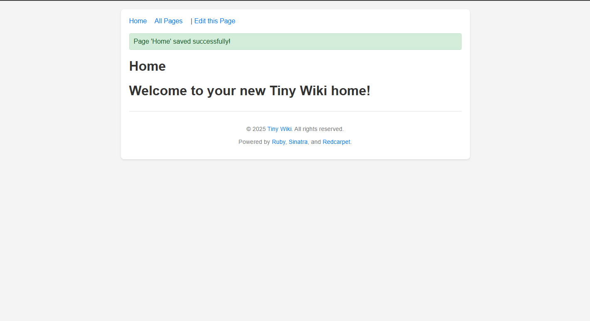

# Tiny Wiki

This is (hopefully) small Ruby gem that you can use to launch and run your own little,
tiny wiki server!

## Usage

- `gem install tiny-wiki`
- `mkdir <foldername>` (or place your markdown files in an existing folder)
- `tiny_wiki_server <foldername>` 

That's it! Open your web browser to `http://localhost:4567`

The ruby gem will automatically use a `Home.md` as your main index file. If this
doesn't exist, then you will be prompted to create a new one and update it!

If you enter a wiki page url that does not yet have content, you will be directed
to the new page editor!

Make use of `[[target page]]` syntax to create embedded links to other wiki pages.

## Development Notes

- `git clone git@github.com:erikyuzwa/tiny-wiki-gem.git`
- `cd tiny-wiki-gem`
- `bundle install`

## License

Copyright 2025 Erik Yuzwa

Permission is hereby granted, free of charge, to any person obtaining a copy of this
software and associated documentation files (the “Software”), to deal in the Software
without restriction, including without limitation the rights to use, copy, modify, merge,
publish, distribute, sublicense, and/or sell copies of the Software, and to permit persons
to whom the Software is furnished to do so, subject to the following conditions:

The above copyright notice and this permission notice shall be included in all copies or
substantial portions of the Software.

THE SOFTWARE IS PROVIDED “AS IS”, WITHOUT WARRANTY OF ANY KIND, EXPRESS OR IMPLIED,
INCLUDING BUT NOT LIMITED TO THE WARRANTIES OF MERCHANTABILITY, FITNESS FOR A PARTICULAR
PURPOSE AND NONINFRINGEMENT. IN NO EVENT SHALL THE AUTHORS OR COPYRIGHT HOLDERS BE LIABLE
FOR ANY CLAIM, DAMAGES OR OTHER LIABILITY, WHETHER IN AN ACTION OF CONTRACT, TORT OR
OTHERWISE, ARISING FROM, OUT OF OR IN CONNECTION WITH THE SOFTWARE OR THE USE OR OTHER
DEALINGS IN THE SOFTWARE.
